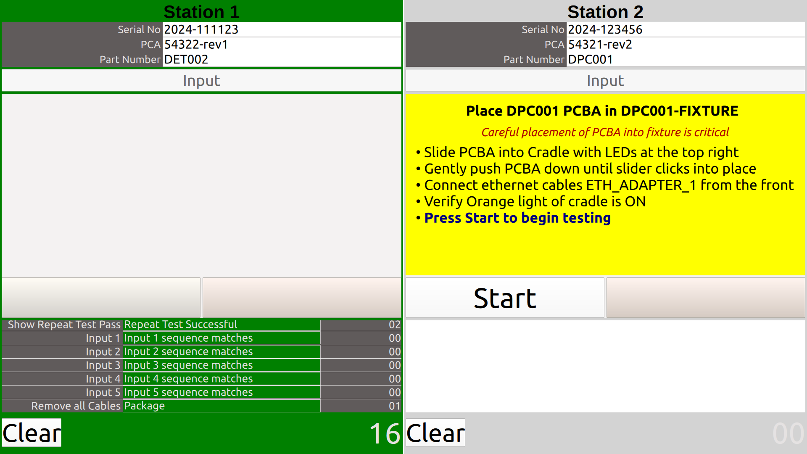
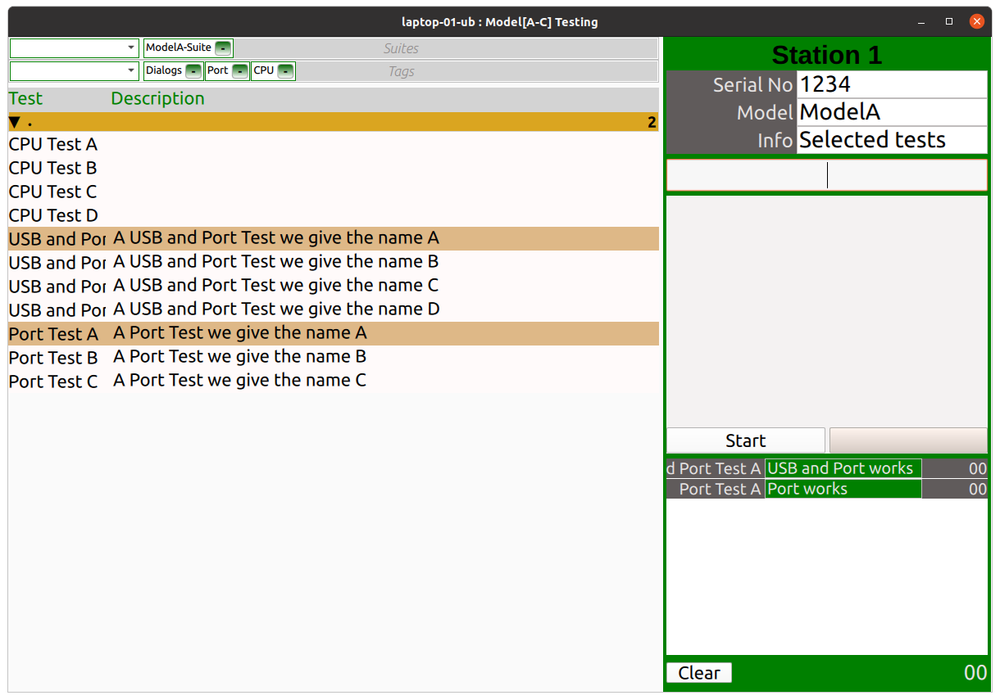

Test Direktor ™ Application Introduction
========================================

*Test Direktor* ™ is a configurable User Interface software, created by `Direkt Embedded ™ <https://www.direktembedded.com/production-software>`_, for automation of embedded product functional and diagnostic testing.

Test execution is through Robot Framework suites using *Test Executor* ™ Python UI library (`testexecutor-ui <https://pypi.org/project/testexecutor-ui/>`_ and `robotframework-testexecutor-ui <https://pypi.org/project/robotframework-testexecutor-ui/>`_) for the execution, monitoring and control of python based tests on a test target.

Multiple device fixtures can be defined for the targets, each identified by user configurable key values
(for example serial number and MAC address) for automatic selection of test suites.

*Test Direktor* ™ has two modes. A Functional Compliance Test mode as testdirektor.fct and a Diagnostics mode
as testdirektor.diag.

- The fct module allows for multiple fixtures which can be run against their corresponding device suites.
- The diag module is a single fixture with user selectable tests.

Example Functional Compliance Testing (FCT)
-------------------------------------------

Example Diagnostics Testing
---------------------------

Framework
---------
The UI is a Pyside6/QML based UI (testexecutor-ui) and has a listener api which is controlled by a Robot Framework Library (robotframework-testexecutor-ui) for each fixture defined.

Configuration
-------------
Configuration is achieved using multiple json files. An upper level host configuration defining one
or more fixtures, each of which has a section to define the UI layout and another section which configures the target identifiers.

Execution
---------
*Test Direktor* ™ can be executed using any python execution method, including virtual environments
and system installation.

References
----------

For more detailed documentation refer `Test Direktor Application <./docs/TestDirektorApplication.rst>`_.

Copyright © 2024 Direkt Embedded Pty Ltd
