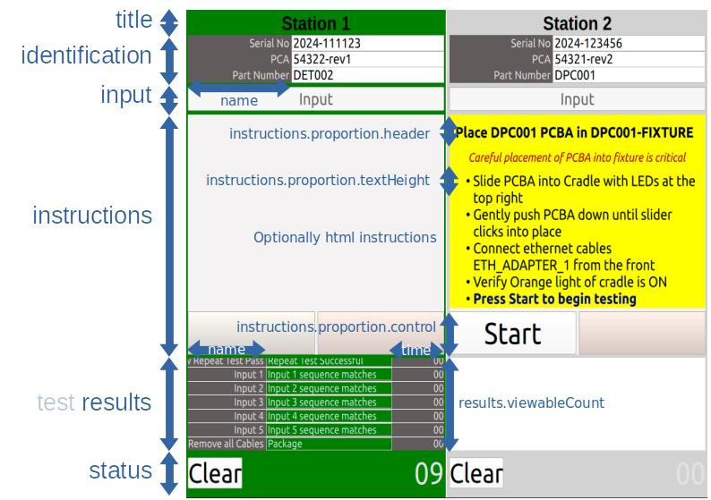

*Test Direktor* ™ Application
=============================

*Test Direktor* ™ is a test execution system for Functional Compliance Test or
Diagnostics of any device, from PCA through post box assembly testing.

The system can be installed on a PC computer powered by say Ubuntu® and designed to be used
in conjunction with Jigs and other infrastructure used to test devices.

The test execution is driven by the popular Open Source Robot Framework which provides
a human readable test language. Complement this with our supporting libraries, or create
custom ones to support your equipment and write easy to read test suites.

Because the Robot Framework provides extensive library sets, you can use any of those as
you require.

For example if your device has a web UI you can use
`Robot Framework's Selenium Library <https://pypi.org/project/robotframework-seleniumlibrary>`_.

Benefits
--------------------

- Operator Centric Automation
- Lower Skilled Operator
- Traceability
- Process Improvement
- User Readable Test Suites
- Flexibility
- Diagnostics
- DAQ (Data Acquisition) Integration
- Best of Open Source
- Extensive Python® Libraries

Example Test Suite
-------------------

Test suites are written in the Robot Framework human readable language.

An example test suite for a hypothetical DET001 devices is provided

.. code-block:: robotframework

    *** Settings ***
    Documentation    Functional Compliance Test Suite for DET001 devices
    Library          LabJackLibrary.LabJackU3
    Library          testdirektor.example.libraries.FctParser
    Suite Setup      Open All
    Suite Teardown   Close All

    *** Test Cases ***

    Verify Vdd
        [Documentation]  Ensure device VDD within bounds
        ${vdd} =         Get Vdd
        ${bounded}=      Evaluate        3.26 < ${vdd} < 3.34
        Should Be True   ${bounded}   message='Vdd ${vdd} not bound by thresholds 3.26, 3.34'
        Log              ${vdd}

    Test Communications
        ${read}=        Set Output 1  0
        Should Be Equal As Numbers  ${read}  0  message='Failed to communicate with device'
        Log             Communications verified by writing 0 to Output 1

    Test ADC 1
        [Documentation]  Verify device ADC accuracy from 0v3 through 3v3
        Verify Adc1 Accuray  0.3  330  0.03
        Verify Adc1 Accuray  1.0  1205  0.03
        Verify Adc1 Accuray  1.5  1827  0.03
        Verify Adc1 Accuray  2.0  2464  0.03
        Verify Adc1 Accuray  2.5  3085  0.03
        Verify Adc1 Accuray  3.0  3718  0.03
        Verify Adc1 Accuray  3.3  4095  0.03

    *** Keywords ***

    Get Vdd
        ${vdd}=          Get Analog Input    0
        [return]         ${vdd}

    Verify Adc1 Accuray
        [Arguments]      ${write}  ${expected}  ${accuracy}
        [Documentation]  Write value to DAC and read ADC from device and ensure accuracy met
        Set Dac          0  ${write}
        ${adc1} =        Get Adc 1
        ${calculated}=   Evaluate  (${adc1} - ${expected}) / ${expected}
        ${accurate} =    Evaluate  (${calculated} < ${accuracy})
        Should Be True   ${accurate}  message='${write}V. Expected ${expected} read as ${adc1}. Accuracy ${calculated} greater than required ${accuracy}'
        Log              ADC 1 value ${adc1}, error ${calculated}

In the example, Keywords like ``Get Analog Input`` are provided by the Robot library
LabJackLibrary.LabJackU3 and ``Set Output`` would be provided by a custom library for the
device under test.

Execution
---------

We recommend you setup multiple environments using independent configuration file sets
to enable execution of a number of different test environments from the
one computer dependent on what is under test.

Although you can install into the system Python, we recommend using
`virtual environments <https://docs.python.org/3/library/venv.html>`_.

If running from a `virtual environment <https://docs.python.org/3/library/venv.html>`_,
the application's Python® module entry points
are fct or diag, providing the top level configuration as a command line argument.

``python3 -m testdirektor.fct /usr/local/share/testdirektor/xyz-model/fct_config.jon``

``python3 -m testdirektor.diag /srv/apps/td/xyz-model/diag_config.json``

or

``fct /usr/local/share/testdirektor/xyz-model/fct_config.jon``

``diag /srv/apps/td/xyz-model/diag_config.json``

By default, the application runs full screen. If you prefer, you can pass in the
command line argument

``--visibility Maximized``

so the application can be resized as required.

Configuration
-------------------
Test Direktor ™ has a number of Json formatted files which can be used to
configure the layout. The configuration defines the number of fixtures, each of
which has a corresponding column in the User Interface. Each fixture column defines the
device identifiers required by the test suites, and locations and formats
of files written.

There is one top-level file which defines host and fixture information, detailed in
the following sections.

Host
^^^^^^
The host section provides a name and id field, for the host computer to uniquely
identify it.

.. csv-table::
  :widths: 50, 50, 200

  name, optional, "String defining the name of the host, or the computer hostname if empty string"
  id, optional, "Unique identifier for the host"

Fixtures
^^^^^^^^^^
Each fixture is displayed as a column in the Test Executor™ User Interface.
The diag application takes a single fixture and the fct application can have multiple.

.. csv-table::
  :widths: 50, 50, 200

  title, required, "A title for the fixture which will show at top of the User Interface column"
  fixture_id, required, "Unique identifier for the fixture"
  id_monitor, optional, "A Python® module which is the id monitor for the device under test allowing for auto start and detection or assignment of device identifiers"

Configurations Files
^^^^^^^^^^^^^^^^^^^^^

There are a number of configuration entries which point at sub-configurations and define
where test suites and output paths are for writing test results.

.. csv-table::
  :widths: 50, 50, 200

  "id_config", required, "Path to the file of the Json config defining the device identifiers as shown in top section of Fixture Column of the UI"
  "ui_config", required, "Path to the file of the Json config defining the layout and colours for each Fixture Column of the UI"
  "test_path", required, "Path to the base of where the test suites are located"
  "base_path", required, "The base path which will be applied to other file paths in rows above if they specify a relative path, starting with ./"
  "output_path", required, "Path to where output files will be saved. This is a shared location across fixtures, so the unique_identifiers (below) are required to ensure unique file names are created."
  "unique_identifiers", required, "Array of string names for the identifiers, as defined in id_config, which will be used to make a unique file name in test_path. For serial and part numbers would be advisable for device testing, as shown in the example host config below"

User Interface Window Layout
^^^^^^^^^^^^^^^^^^^^^^^^^^^^

The image below shows the UI layout for the example configuration detailed below,
illustrating the parts of the configuration which define the proportions of the
UI elements. The configuration provides a flexible layout, with the intent of creating
a defined layout once, to suit test operation for a given device family.
The example below shows a layout for two fixtures, titled Station 1 and Station 2.

The two columns are defined by the host configuration.

The three identifiers, Serial No, PCA and Part Number are defined in the *id_config* file.

The colours and proportions of the
title, identification, input, instructions (header, control), results and status
are defined in the *ui_config* file.

Example Configuration
^^^^^^^^^^^^^^^^^^^^^

Host Configuration
""""""""""""""""""

The following host configuration is for our example two column/fixture
setup of Station 1 and Station 2.

.. code-block:: json

  {
    "title": "DET/DPC Functional Compliance Testing",
    "host": {
      "name": "",
      "id": "1234"
    },
    "fixtures": [
        {
          "title": "Station 1",
          "fixture_id": "04561"
        },
        {
          "title": "Station 2",
          "fixture_id": "04562"
        }
    ],
    "id_config": "./id_config.json",
    "ui_config": "./ui_config.json",
    "base_path": "./",
    "test_path": "./",
    "output_path": "/var/log/td/fct",
    "unique_identifiers": ["serial", "part"]
  }

User Interface Configuration
""""""""""""""""""""""""""""""

The following User Interface (UI) configuration details the layout for the UI
for each of our columns: three identifiers, a narrow input and large buttons
(in the status section) to improve touch screen control.

.. code-block:: json

    {
      "states": {
        "idle": { "color": {"default": "lightgray", "pass": "green", "fail": "red"}, "button": {"text": "Clear"} },
        "ready": { "color": "gray", "button": {"text": "Clear"}},
        "running": { "color": "gray", "button": {"text": "Stop"}},
        "stopped": { "color": "orange", "button": {"text": "Clear"}}
      },

      "proportion": {
        "title": 0.1,
        "identification": 0.1,
        "input": 0.05,
        "instructions": 0.5,
        "status": 0.08
      },

      "results": {
        "viewableCount": 7,
        "color": "#e5e2e2",
        "item": {
          "proportion": {
            "name": 0.3,
            "time": 0.2
          },
          "color": "#605b5b",
          "border": {"color": "#00000000"},
          "name": {
            "color": "#605b5b",
            "text": {"color": "#e5e2e2"}
          },
          "feedback": {
            "color": "#8e8a8a",
            "border": {"color": "#b9e5e2e2"},
            "text": {"color": {"default": "black", "progress": "#e5e2e2"}},
            "progress": {"color": "green"}
          },
          "time": {
            "color": "#605b5b",
            "text": {"color": "#e5e2e2"}
          }
        }
      },

      "input": {
        "allow_focus": false
      },

      "identification": {
        "item": {
          "proportion": {
            "name": 0.4
          },
          "color": "#605b5b",
          "border": { "color": "#00000000" },
          "name": {
            "color": "#00000000",
            "text": {"color": "#e5e2e2"},
            "border": {"color": "#00000000"}
          },
          "value": {
            "color": "#ffffff",
            "border": {"color": "#b9e5e2e2"},
            "text": {"color": "black"}
          }
        }
      },

      "instructions": {
        "color": {"default": "#f4f2f2", "active": "yellow"},
        "proportion": {"header": 0.1, "textHeight": 0.064, "control": 0.18}
      }
    }

Each of the sections of the UI is configurable based on a proportion/percentage
of the window height or width, and will auto-scale when it is resized.

Identifier Configuration
"""""""""""""""""""""""""

The identifier configuration details identifiers of the devices under test
as displayed on the top section of the UI columns. It provides auto detection
driven by a regular expression. There can be one or multiple identifiers
specified.

Once all required identifiers are present the test can be started.

The following is an example configuration with three identifiers, one of
which is optional

.. code-block:: json

    {
      "identifiers": [
        {
          "table": {"name": "td.device", "field":  {"name": "part_serial"}},
          "key": "serial",
          "name": "Serial No",
          "match": "\\d{4}-\\d{6}"
        },
        {
          "table": {"name": "td.device", "field":  {"name": "part_info_1"}},
          "key": "pca",
          "name": "PCA",
          "match": "\\d{5}-rev[\\w\\d]",
          "optional": "true"
        },
        {
          "table": {"name": "td.device", "field":  {"name": "part_number"}},
          "key": "part",
          "name": "Part Number",
          "match": "DET\\d{3}|DPC\\d{3}"
        }
      ],
      "suites": {
        "path": "./suites",
        "selector": [
          {
            "id": "part",
            "table": {"name": "td.device", "field":  {"name": "part_type", "value":  "DPC"}},
            "match": "DPC.*",
            "suite": "DPC001-Suite.robot",
            "instruction": {"url": "./instructions/DPC001-instruction.html"}
          },
          {
            "id": "part",
            "table": {"name": "td.device", "field":  {"name": "part_type", "value":  "DET"}},
            "match": "DET002",
            "suite": "DET002-Suite.robot",
            "instruction": {"url": "./instructions/DET002-instruction.html"}
          },
          {
            "id": "part",
            "table": {"name": "td.device", "field":  {"name": "part_type", "value":  "DET"}},
            "match": "DET001.*",
            "suite": "DET001-Suite.robot",
            "instruction": {"url": "./instructions/DET001-instruction.html"}
          }
        ]
      }
    }

There are two sections to the identifier configuration.

The identifiers section defines what the 'ids' are, each of which will be
available to the test suite via robot variables. The following table details
each entry.

.. csv-table::
  :widths: 50, 50, 200

  "key", required, "Unique identifier key for this value"
  "name", required, "Label name to be displayed in the identifier box of the UI"
  "match", required, "Regular expression when if matched against Input will populate the value of this key"
  "table", optional, "Json entry defining a table and field name which will be saved as json meta data to Robot Framework test results"

From the example, the unique identifier with key 'part', has a match of
"DET\\d{3}|DPC\\d{3}"
which means it will match any input text starting with DET or DPC, which
represent our sample devices like DET001 and DPC001 as two example device models.

The suites section defines what test suites are executed when the suite is
started.

.. csv-table::
  :widths: 50, 50, 200

  "id", required, "The unique key of the identifier in the identifiers section to match against for suite"
  "match", required, "Regular expression when if matched against id value, will select this suite"
  "suite", required, "Path to the suite to execute on start"
  "instructions", optional, "Instructions displayed when matching identifier entered into respective id. Relative paths are relative to the test_path of the host_config"
  "table", optional, "Json entry defining a table and field name which will be saved as json meta data to Robot Framework test results"

Combining the identifier and suites section results in the detection
logic that any

- part starting with DPC will execute suite DPC001-Suite.robot
- part matching exactly DET002 will execute suite DET002-Suite.robot
- part starting with DET001 will execute DET001-Suite.robot

and for each of those the instructions shown to the user before starting are
taken from the instructions folder, as html files.
Note this supports the `QT® UI Frameworks subset of html <https://doc.qt.io/qt-6/richtext-html-subset.html>`_.
